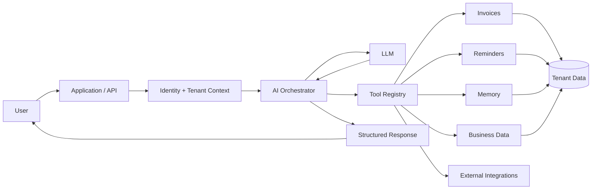
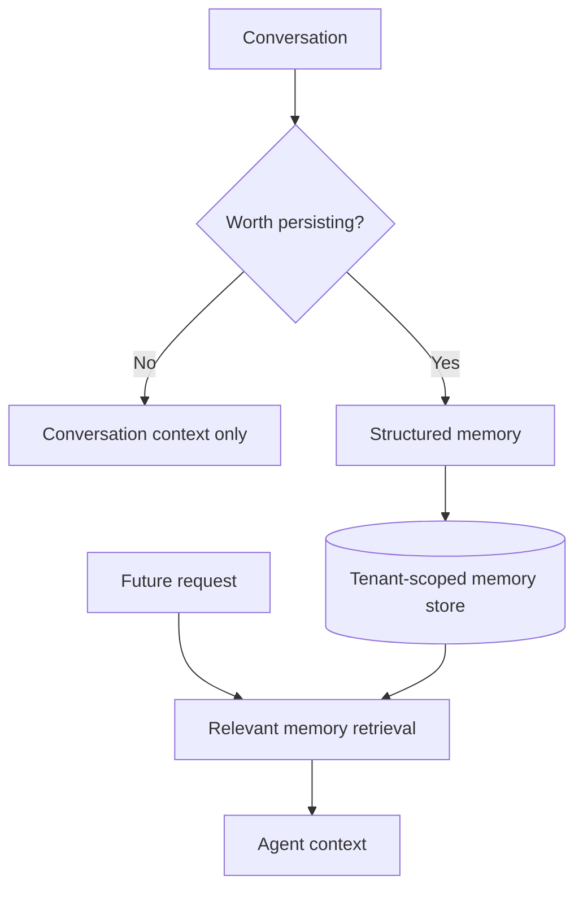
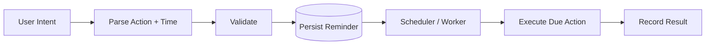
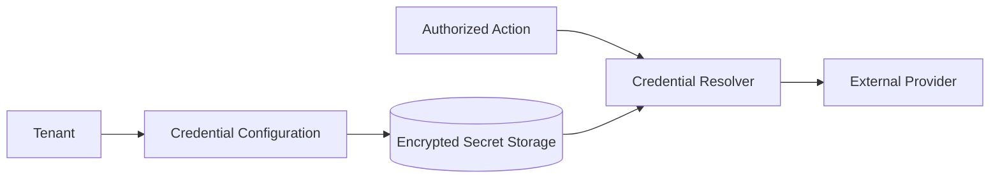

# Koowky Engineering

> Engineering case study of a multi-tenant AI secretary platform for SMB operations, memory, invoicing, reminders, and tool-driven workflows.

**Product:** [koowky.ai](https://koowky.ai/)

Koowky explores a practical version of an AI agent: not a chatbot that only produces text, but a business assistant that can understand a request, resolve the correct workspace context, use controlled tools, persist useful information, and carry operational workflows forward.

I worked on the platform architecture and implementation across the AI, multi-tenant, workflow, integration, and SaaS layers. The system evolved from early workflow orchestration into a more application-owned backend architecture as the product requirements became more complex.

This repository documents those engineering decisions without publishing the private production codebase, customer data, credentials, or proprietary workflows.

---

## The problem

Small businesses operate across fragmented information and repetitive tasks.

A request such as:

> "Remind this customer about the unpaid invoice next week."

contains several separate engineering problems:

```text
Who is the user?
      ↓
Which business/workspace?
      ↓
Which customer?
      ↓
Which invoice?
      ↓
What does "next week" mean?
      ↓
Is the user allowed to do this?
      ↓
Which tool should execute it?
      ↓
What should be persisted?
      ↓
How do we verify the action?
```

The LLM is only one component of that pipeline.

Koowky therefore treats the model as a **reasoning and routing layer inside a controlled application**, rather than giving it unrestricted ownership of business state.

## System overview



The key boundary is deliberate:

**the model can propose an action; application code decides how that action is validated and executed.**

## Multi-tenancy

Multi-tenancy is a security boundary, not a UI feature.

Every business-owned resource needs tenant context:

```ts
type TenantResource = {
  id: string;
  tenantId: string;
  // resource-specific fields
};
```

A request should establish the tenant before business data is queried or a tool is executed.

```text
Authenticated user
      ↓
Membership lookup
      ↓
Active tenant/workspace
      ↓
Authorization
      ↓
Tenant-scoped operation
```

The dangerous pattern is:

```sql
SELECT * FROM invoices WHERE id = ?
```

The safer conceptual pattern is:

```sql
SELECT *
FROM invoices
WHERE id = ?
  AND tenant_id = ?
```

That constraint needs to exist consistently across invoices, customers, reminders, memories, settings, integrations, and agent tools.

## Agent orchestration

Koowky's agent layer converts natural-language intent into controlled operations.

A simplified loop looks like:

```python
context = build_tenant_context(user)

response = model.reason(
    conversation=messages,
    available_tools=tools_for(context)
)

while response.requests_tool:
    call = validate_tool_call(response.tool_call, context)
    result = execute(call)

    response = model.reason(
        conversation=messages,
        tool_result=result
    )

return response
```

The production implementation is more nuanced, but this captures the important architecture: **tool execution happens outside the model**.

## Tool calling

Tools expose narrow business capabilities rather than raw database access.

Examples conceptually include:

```text
create_invoice(...)
find_customer(...)
schedule_reminder(...)
save_memory(...)
search_business_data(...)
update_invoice_status(...)
```

A tool contract can be represented as:

```ts
type AgentTool<I, O> = {
  name: string;
  description: string;
  validate(input: unknown): I;
  authorize(input: I, context: TenantContext): Promise<void>;
  execute(input: I, context: TenantContext): Promise<O>;
};
```

This gives the application several control points:

- schema validation
- tenant isolation
- authorization
- deterministic execution
- logging
- error handling

## Business memory

A useful secretary needs continuity.

But "memory" should not mean putting every previous conversation into every prompt.

Koowky separates conversational context from durable business information.



Useful memory can include preferences, operational facts, recurring instructions, or business context that improves future actions.

The engineering problem is deciding **what should persist, how it is scoped, and when it should be retrieved**.

## Invoices

Invoices are structured business objects, not generated text.

A simplified domain model might include:

```ts
type Invoice = {
  id: string;
  tenantId: string;
  customerId: string;
  status: "draft" | "sent" | "paid" | "overdue";
  items: InvoiceItem[];
  subtotal: number;
  total: number;
  dueAt?: Date;
};
```

The agent can help create or retrieve an invoice, but totals, ownership, status transitions, and persistence remain deterministic application responsibilities.

## Reminders & scheduled work

A secretary frequently needs to act later rather than immediately.



Persisting scheduled work separately from the conversation makes execution resilient to sessions ending or users leaving the application.

Important concerns include:

- timezone handling
- retries
- idempotency
- cancellation
- execution state
- audit history

## From workflow automation to application backend

Early versions of Koowky used **n8n** heavily for workflow orchestration.

That was useful for quickly validating integrations and business flows.

As requirements expanded, application-owned backend logic became increasingly important.

```text
Early stage
LLM → n8n → integrations

        ↓ product complexity grows

Application backend
├── auth / tenants
├── domain logic
├── agent orchestration
├── tool registry
├── persistence
└── integrations
        ↓
external workflow/integration services where useful
```

This evolution avoids forcing core domain behavior into increasingly complex visual workflows while retaining automation tools where they provide leverage.

## Dynamic routing

One of the practical challenges was routing operations to the correct business context and data destination.

The system cannot safely assume that a generated action belongs to whichever data source happens to be convenient.

Conceptually:

```text
request
  ↓
authenticated identity
  ↓
tenant
  ↓
resource / destination resolution
  ↓
authorized tool
  ↓
operation
```

This becomes especially important when external systems contain multiple workspaces, sheets, tabs, accounts, or integration credentials.

## BYOK integrations

For integrations such as communications providers, a multi-tenant product may allow businesses to connect their own account credentials.

A safe architecture treats those credentials as tenant-owned secrets:



Credentials should never be exposed to the model prompt or returned to the client.

## Subscription & capability gating

SaaS plans can expose different capabilities.

A useful design separates entitlement checks from presentation:

```text
subscription
    ↓
entitlements
    ↓
authorized capability
    ↓
UI / API / agent tool availability
```

This means hiding a button is not considered sufficient enforcement. The backend and tool layer should enforce the same capability rules.

## Reliability

Agentic systems introduce failure modes beyond conventional CRUD applications.

Examples include:

- invalid tool arguments
- duplicate tool execution
- ambiguous entity selection
- provider failure
- model retries
- stale context
- partially completed workflows

The application needs deterministic safeguards around the probabilistic component.

Useful patterns include:

- schema-constrained tool inputs
- idempotency keys
- explicit execution states
- retries with limits
- audit logs
- confirmation for sensitive actions
- structured tool results

## Technology & engineering areas

| Area | Focus |
| --- | --- |
| Product | Multi-tenant SaaS |
| AI | LLM orchestration and tool calling |
| Automation | n8n and application-owned workflows |
| Data | tenant-isolated operational data |
| Business capabilities | invoices, reminders, memory |
| Integrations | communications and external services |
| Billing | subscription / tier gatekeeping |
| Reliability | validation, retries, idempotency, auditability |
| Deployment | production web/backend infrastructure |

## Engineering challenges

### Keeping the model inside application boundaries

The LLM is useful for interpreting intent but should not bypass authorization or directly mutate arbitrary business state.

### Tenant isolation across tools

Every agent capability must preserve the same tenant boundary as a conventional API endpoint.

### Durable actions from conversational requests

A reminder created in a chat still has to execute after that chat session is gone.

### Evolving beyond prototype orchestration

Low-code workflow tools accelerate early development, but product complexity eventually benefits from moving critical domain logic into versioned, testable application code.

### Making AI actions observable

When an automated action fails, the system needs enough structured information to determine whether the failure came from reasoning, validation, domain logic, infrastructure, or an external provider.

## What I worked on

My work on Koowky included engineering across:

- multi-tenant application architecture
- AI orchestration and tool calling
- tenant-aware dynamic routing
- invoices and operational workflows
- reminders and scheduled actions
- persistent business memory
- n8n-based workflow automation
- migration toward application-owned backend workflows
- external integrations
- tenant-specific integration configuration
- subscription tier gatekeeping
- production SaaS architecture

## Why this repository exists

Koowky is a production product and its private implementation is not published here.

This repository explains the architecture and engineering decisions using generalized examples. It intentionally excludes production source code, credentials, customer data, private prompts, proprietary workflows, and confidential integration details.

---

Learn more at **[koowky.ai](https://koowky.ai/)**.
