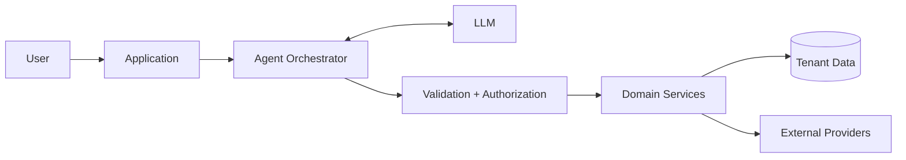

# Architecture Notes

## Trust boundaries

Koowky's architecture is easier to understand by separating trusted deterministic components from probabilistic reasoning.



The LLM does not become a privileged database client.

## Request lifecycle

A tool-driven request conceptually follows:

1. authenticate the user
2. resolve active tenant
3. determine available capabilities
4. construct model context
5. receive structured tool request
6. validate schema
7. authorize against tenant and plan
8. execute domain service
9. record outcome
10. return structured result to the model
11. generate user-facing response

## Agent vs. domain services

A useful boundary is:

```text
Agent:
"What is the user trying to accomplish?"

Domain service:
"Is this valid, authorized, and how exactly is it executed?"
```

That separation makes domain behavior independently testable.

## Background work

Long-lived or scheduled actions should not depend on an active HTTP request.

```text
API / Agent
    ↓
persistent job
    ↓
queue / scheduler
    ↓
worker
    ↓
domain action
    ↓
status / audit record
```

## Integration boundary

External providers are wrapped behind application-owned interfaces. This limits provider-specific behavior from leaking throughout the product and makes failures easier to classify.
